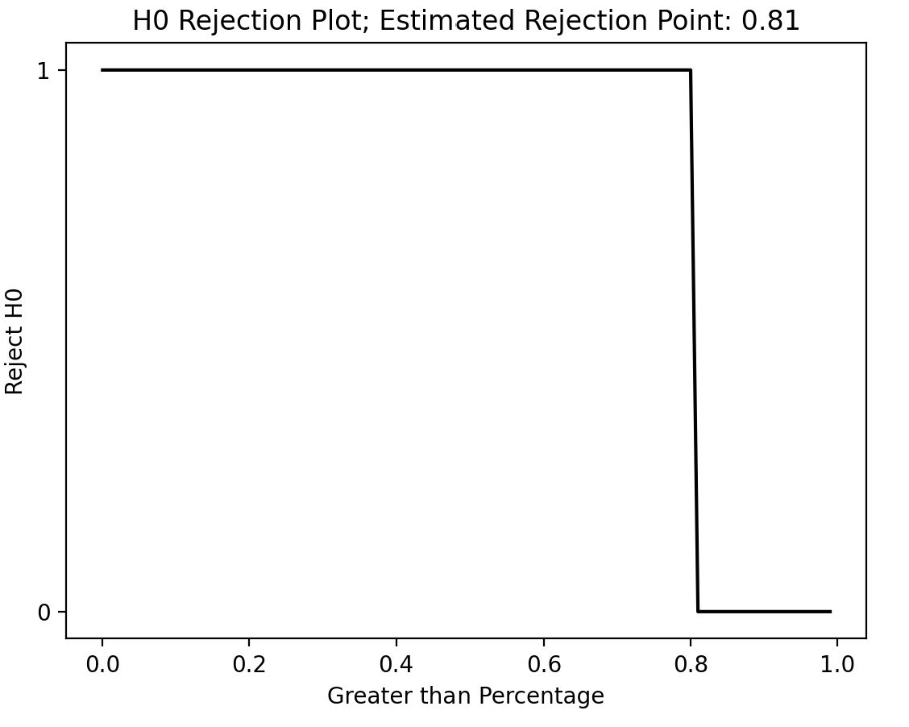
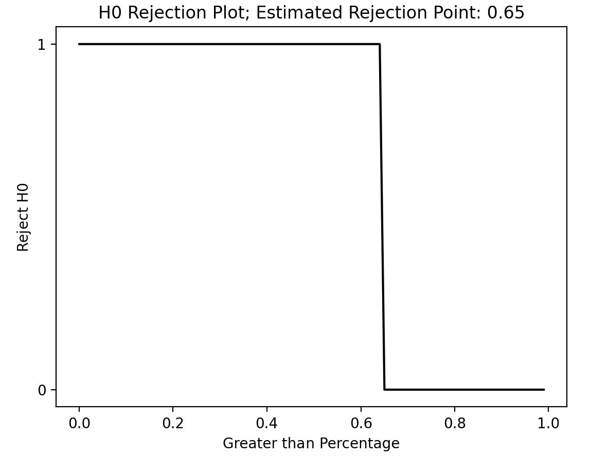
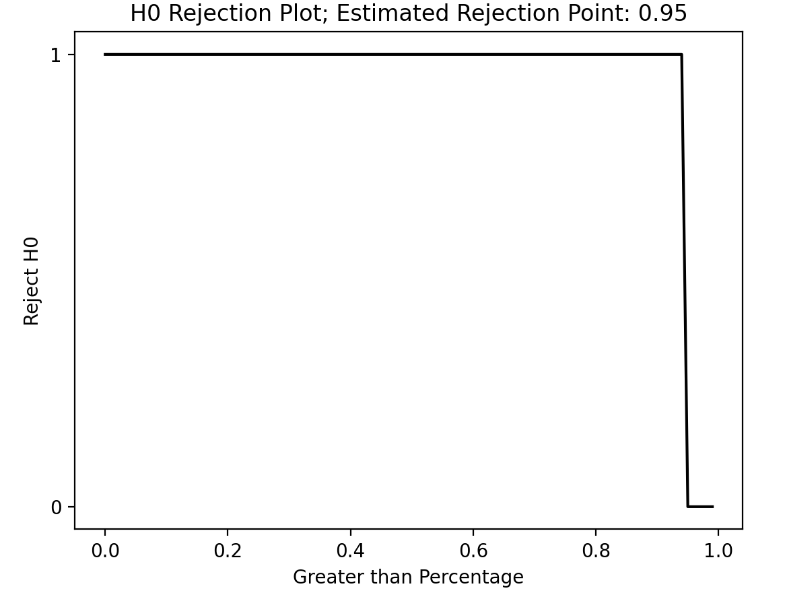

## Simulations

This section will conduct a series of simulations to better understand fukkatsu's potential capabilities. To achieve this, multiple error types will be tested. Each error type and scenario will consist of a total of 50 runs under the same conditions. We will test the following hypotheses:

### Hypotheses testing

- H0: `The proportion of errors solved is not significantly greater than 0.5.`
- H1: `The proportion of errors solved is significantly greater than 0.5.`

We will consider a confidence interval of 0.05 and utilize a binomial distribution.

fukkatsu will utilize the `gpt-3.5-turbo` model in all simulations. For each simulation, 3 lives will be allocated. The functions will also be provided with sufficient context. 

After conducting all simulations, we will apply a `chi-square test`. This test will help determine whether there is a statistically significant difference in the fukkatsu's performance across the error types. If the test results indicate a significant association, it suggests that the effectiveness of fukkatsu varies depending on the error type.

You can see each simulation recored in the different jupyter notebooks contained within the `research` directory.

## Results

### Simulation Summary

| **Error Type** | **Error Name** | **Success** | **Failure** |    **Date**    |   **Version**  | **Commit ID** | **p-value** | **alpha** |**Rejected H0** |
|------------|------------|---------|---------|------------|------------|-----------|---------|--------|-------|
|UnicodeDecodeError |  [Parser Error](https://github.com/maxmekiska/fukkatsu/blob/main/research/simulationNotebooks/fukkatsuParserError.ipynb) |   45    |   5     | 19/06/23 |   0.0.7  | 9d3ec24   | 2.104926011270436e-09 |0.05| Yes    |        
| TypeError |   [Type Error](https://github.com/maxmekiska/fukkatsu/blob/main/research/simulationNotebooks/fukkatsuTypeError.ipynb)  |   38     |   12    | 19/06/23 |   0.0.7     |2903c2a|   0.00015293200080179759 | 0.05 |  Yes  | 
| ValueError |   [Parse Date Error](https://github.com/maxmekiska/fukkatsu/blob/main/research/simulationNotebooks/fukkatsuValueError.ipynb)  |   50     |   0    | 30/06/23 |   0.0.9     |6fe478c|  8.881784197001252e-16  | 0.05 |  Yes  | 

### H0 Rejection Plots

#### `Parser Error`

- 45 repair successes
- 5 repair failures
- alpha 0.05

 

  

#### `Type Error`

- 38 repair successes
- 12 repair failures
- alpha 0.05

 

  

#### `Parse Date Error`

- 50 repair successes
-  0 repair failures
- alpha 0.05

 

  

